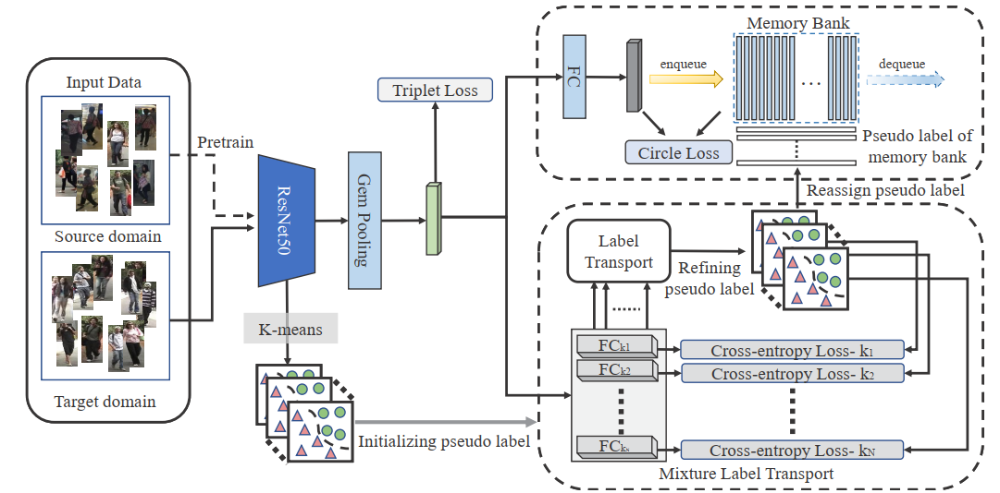

# Mixture Label Transport

This repository contains the implementation of the NeurIPS-2020 submission [Bridging the Gap Between Supervised and Unsupervised Performance on Person Re-identification via Mixture Label Transport](https://nips.cc/).
**Please note that** it is a *pre-released* repository for the anonymous review process, and the *official* repository will be released upon the paper published.

Code is coming soon.


## Requirements

### Installation

```shell
git clone https://github.com/MLT-reid/MLT
cd MLT

```

### Prepare Datasets

```shell
cd examples && mkdir data
```
Download the person datasets [DukeMTMC-reID](https://arxiv.org/abs/1609.01775), [Market-1501](https://drive.google.com/file/d/0B8-rUzbwVRk0c054eEozWG9COHM/view), [MSMT17](https://arxiv.org/abs/1711.08565), Then unzip them under the directory like
```
SpCL/examples/data
├── dukemtmc
│   └── DukeMTMC-reID
├── market1501
│   └── Market-1501-v15.09.15
├── msmt17
    └── MSMT17_V1

```

You can create the soft link to the dataset:
```shell
ln -s /path-to-data ./data
```

ImageNet-pretrained models for **ResNet-50** will be automatically downloaded in the python script.


## Training

We utilize 4 GPUs for training. **Note that**


### Stage I: Pretrain Model on Source Domain
To train the model(s) in the source domain, run this command:
```shell
sh script/pretrain.sh -ds $SOURCE_DATASET $TARGET_DATASET $SOURCE_DATASET resnet50 0
```

*Example #1:* DukeMTMC-reID -> Market-1501
```shell
sh script/pretrain.sh dukemtmc market1501 resnet50 0
```


### Stage II: End-to-end training with MLT

Utilizeing K-Means clustering algorithm

```shell
sh scripts/train_slabel_mticluster.sh market1501 dukemtmc resnet50 0 {log_path_name} 600,700,800 1
```
600,700,800 denotes to the multi-class strategy

Utilizeing dbscan clustering algorithm

```shell
 sh scripts/train_slabel_dbscan.sh market1501 dukemtmc resnet50 {dropout} {log_path_name} 0
```


## Trained Models



You can download the above models in the paper from [Google Drive]().
